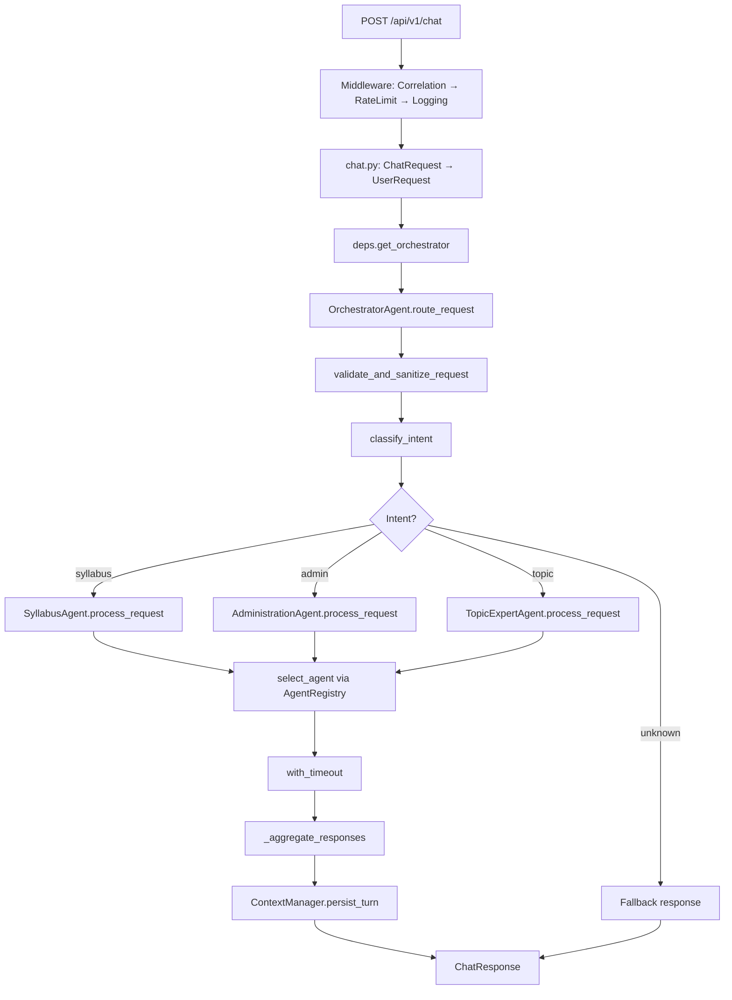
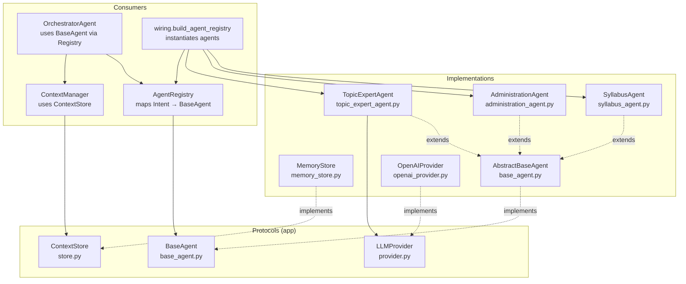
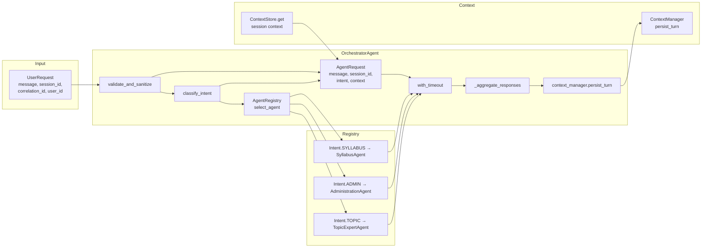

# Phase 1: Detailed Mermaid Diagrams (for tldraw)

This file contains Mermaid diagrams that describe Phase 1 of the Education Chatbot: **foundation framework**, **request flow**, and **code relationships**. You can copy any diagram block into [tldraw](https://tldraw.com) (or use a Mermaid-to-tldraw converter) to view and edit.

---

## 1. Phase 1 high-level request flow

End-to-end path from HTTP request to response.

```mermaid
flowchart LR
    subgraph Client
        A[Client]
    end
    subgraph API["app/api"]
        B[main.py\ncreate_app]
        C[CorrelationIdMiddleware]
        D[RateLimitMiddleware]
        E[LoggingMiddleware]
        F[chat.router\nPOST /api/v1/chat]
        G[health.router\nGET /api/v1/live|ready|ready/agents]
    end
    subgraph Deps["app/api/deps.py"]
        H[get_orchestrator]
        I[get_context_store\n→ MemoryStore]
        J[get_context_manager]
        K[build_agent_registry]
    end
    subgraph Orchestrator["app/orchestrator"]
        L[OrchestratorAgent\nroute_request]
        M[classify_intent]
        N[routing.select_agent\n→ AgentRegistry]
        O[with_timeout\nagent.process_request]
        P[_aggregate_responses]
        Q[ContextManager.persist_turn]
    end
    subgraph Agents["app/agents/information"]
        R[SyllabusAgent]
        S[AdministrationAgent]
        T[TopicExpertAgent]
    end
    subgraph Services["app/services"]
        U[ContextStore\nMemoryStore]
    end

    A --> B
    B --> C --> D --> E
    E --> F
    E --> G
    F --> H
    H --> I
    H --> J
    H --> K
    H --> L
    L --> M
    M --> N
    N --> R
    N --> S
    N --> T
    L --> O
    O --> R
    O --> S
    O --> T
    O --> P
    P --> Q
    Q --> U
    L --> U
```

---

## 2. Phase 1 request flow (simplified vertical)

Same flow in a top-to-bottom layout for readability.



---

## 3. Code / module dependency graph

Which Python modules import which (Phase 1 relevant paths only).

```mermaid
flowchart TB
    subgraph Entry["Entry & API"]
        main["app/api/main.py"]
        chat_router["app/api/routers/chat.py"]
        health_router["app/api/routers/health.py"]
        deps["app/api/deps.py"]
    end

    subgraph Middleware["Middleware"]
        corr["app/api/middleware/correlation.py"]
        ratelimit["app/api/middleware/ratelimit.py"]
        logging_mw["app/api/middleware/logging_mw.py"]
    end

    subgraph Orchestrator["Orchestrator"]
        orch_agent["app/orchestrator/orchestrator_agent.py"]
        wiring["app/orchestrator/wiring.py"]
        registry["app/orchestrator/registry.py"]
        routing["app/orchestrator/routing.py"]
        context_mgr["app/orchestrator/context_manager.py"]
        types["app/orchestrator/types.py"]
        policies["app/orchestrator/policies.py"]
        tracing["app/orchestrator/tracing.py"]
    end

    subgraph Agents["Agents"]
        base_agent["app/agents/base/base_agent.py"]
        syllabus["app/agents/information/syllabus_agent.py"]
        admin["app/agents/information/administration_agent.py"]
        topic["app/agents/information/topic_expert_agent.py"]
    end

    subgraph Services["Services"]
        store_proto["app/services/context/store.py\nContextStore protocol"]
        memory_store["app/services/context/memory_store.py\nMemoryStore"]
        llm_provider["app/services/llm/provider.py\nLLMProvider protocol"]
        openai_provider["app/services/llm/openai_provider.py"]
    end

    subgraph Config["Config & utils"]
        settings["app/config/settings.py"]
        errors["app/utils/errors.py"]
        logging["app/observability/logging.py"]
    end

    main --> corr
    main --> ratelimit
    main --> logging_mw
    main --> chat_router
    main --> health_router

    chat_router --> deps
    chat_router --> types
    chat_router --> errors
    health_router --> deps

    deps --> settings
    deps --> context_mgr
    deps --> orch_agent
    deps --> tracing
    deps --> wiring
    deps --> memory_store
    deps --> openai_provider

    wiring --> syllabus
    wiring --> admin
    wiring --> topic
    wiring --> registry
    wiring --> types
    wiring --> llm_provider

    orch_agent --> logging
    orch_agent --> policies
    orch_agent --> routing
    orch_agent --> types
    orch_agent --> errors
    orch_agent --> base_agent
    orch_agent --> context_mgr
    orch_agent --> registry
    orch_agent --> tracing
    orch_agent --> store_proto

    routing --> registry
    routing --> types
    routing --> base_agent

    registry --> types
    registry --> base_agent

    context_mgr --> store_proto

    base_agent --> types
    syllabus --> base_agent
    syllabus --> types
    admin --> base_agent
    admin --> types
    topic --> base_agent
    topic --> types
    topic --> llm_provider

    memory_store --> store_proto
    openai_provider --> llm_provider
```



---

## 4. Protocol and implementation relationship

Phase 1 interfaces (protocols) and their concrete implementations.



---

## 5. Orchestrator and agent wiring (data flow)

How the orchestrator uses registry, context, and policies.



---

## 6. Phase 1 directory and file map

Map from Phase 1 concepts to actual `app/` paths.

```mermaid
flowchart TB
    subgraph Phase1Concepts["Phase 1 concepts"]
        P1_API[API layer]
        P1_Orch[Orchestrator]
        P1_Syllabus[Syllabus Agent]
        P1_Admin[Administration Agent]
        P1_Topic[Topic Expert Agent]
        P1_Context[Shared context]
        P1_Health[Health]
    end

    subgraph AppPaths["app/ paths"]
        api_main["app/api/main.py"]
        api_chat["app/api/routers/chat.py"]
        api_health["app/api/routers/health.py"]
        api_deps["app/api/deps.py"]
        orch_agent["app/orchestrator/orchestrator_agent.py"]
        orch_wiring["app/orchestrator/wiring.py"]
        orch_registry["app/orchestrator/registry.py"]
        orch_routing["app/orchestrator/routing.py"]
        orch_types["app/orchestrator/types.py"]
        orch_context_mgr["app/orchestrator/context_manager.py"]
        agents_base["app/agents/base/base_agent.py"]
        agents_syllabus["app/agents/information/syllabus_agent.py"]
        agents_admin["app/agents/information/administration_agent.py"]
        agents_topic["app/agents/information/topic_expert_agent.py"]
        svc_store["app/services/context/store.py"]
        svc_memory["app/services/context/memory_store.py"]
        svc_llm["app/services/llm/provider.py"]
    end

    P1_API --> api_main
    P1_API --> api_chat
    P1_API --> api_deps
    P1_Health --> api_health
    P1_Orch --> orch_agent
    P1_Orch --> orch_wiring
    P1_Orch --> orch_registry
    P1_Orch --> orch_routing
    P1_Orch --> orch_types
    P1_Orch --> orch_context_mgr
    P1_Syllabus --> agents_syllabus
    P1_Admin --> agents_admin
    P1_Topic --> agents_topic
    P1_Syllabus --> agents_base
    P1_Admin --> agents_base
    P1_Topic --> agents_base
    P1_Context --> svc_store
    P1_Context --> svc_memory
    P1_Context --> orch_context_mgr
    P1_Topic --> svc_llm
```



---

## How to use in tldraw

1. Copy the contents of a single Mermaid code block (from ` ```mermaid ` to ` ``` `).
2. In tldraw: use an Mermaid import option if available, or paste into a text shape and use a Mermaid-to-shapes extension.
3. Alternatively, use [mermaid.live](https://mermaid.live) to render the diagram, then export as SVG/PNG and import the image into tldraw.

Reasoning for the diagrams: **Diagrams 1–2** show the Phase 1 request and control flow. **Diagram 3** shows which source files depend on which. **Diagram 4** shows protocol vs implementation and who uses each. **Diagrams 5–6** tie orchestrator wiring and Phase 1 concepts to the actual code paths.
