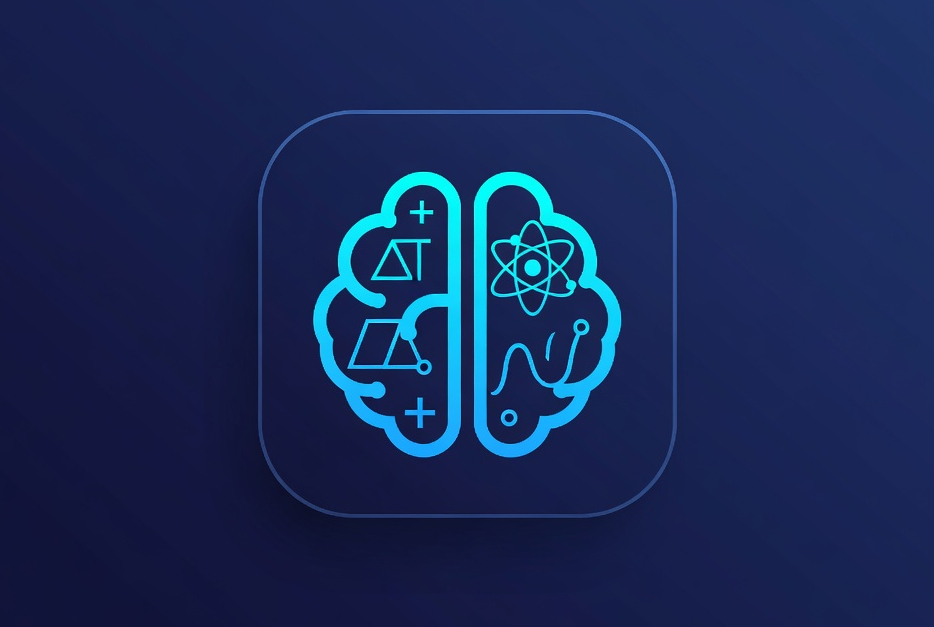

## Education Chatbot

<p align="center">
  
</p>

An intelligent, multi-agent educational assistant. It handles informational queries (syllabus, administration, exams, topics), delivers adaptive assessments (quizzes, programming tests, verbal concept checks, viva/mock interviews), monitors student performance for faculty alerts, and guides problem-solving with guardrails to foster deep understanding and independent learning.

### Why

- **Personalized support**: Tailors guidance to each learner’s level and progress.
- **Guardrails-first**: Promotes conceptual understanding instead of copy-paste answers.
- **Faculty visibility**: Surfaces at-risk students for timely intervention.

---

## Features

- **Informational Q&A**: Syllabus, course logistics, topic lookups.
- **Adaptive assessments**: Quizzes, coding tests, verbal concept checks, viva/mock interviews.
- **Performance monitoring**: Trends, thresholds, and faculty alerts.
- **Guided problem-solving**: Capability assessment, concept-first hints, solution withholding when fundamentals are weak, similar-problem generation, visual explanations.
- **Multi-modal I/O**: Text; planned support for voice and problem image uploads.

---

## Architecture (High Level)

- **Multi-agent system**
  - Problem-Solving Agent (with guardrails)
  - Assessment Agent (adaptive quizzes/tests)
  - Performance Analytics Agent (monitoring, alerts)
  - Content Retrieval / KB Agent (curriculum, concepts, examples)
  - Faculty Interface / API Agent (dashboard integration)
- **Data layers**
  - Student profiles and interaction history
  - Performance metrics and trends
  - Curriculum/knowledge base (concept graph, problem metadata)
- **Integrations (planned)**
  - LMS platforms
  - Assessment tools (QTI/SCORM where applicable)
  - Faculty dashboards and notifications

---

## Guardrails (Problem-Solving)

- Assess capability before revealing solutions.
- Prioritize concept-first explanations and prerequisite checks.
- Withhold direct solutions when basics are lacking.
- Offer similar problems, structured hints, and visual representations.
- Track mastery and progression over time.

---

## Data Model (Conceptual)

- **Students**: Profile, learning history, accessibility preferences.
- **Assessments**: Attempts, scores, difficulty, modality.
- **Performance metrics**: Rolling windows, thresholds, alerts.
- **Curriculum**: Concepts, prerequisites, problems, solutions, metadata.
- **Audit & privacy**: Anonymization, minimization, retention policies.

---

## Security & Privacy

- Privacy by design (minimization, anonymization).
- Role-based access for students and faculty.
- Compliance considerations: FERPA/GDPR depending on deployment.
- Audit logging and integrity protections.

---

## Getting Started

**Stack**: Python 3.13+, FastAPI, PostgreSQL, Redis. See [GETTING_STARTED.md](GETTING_STARTED.md) for full setup.

### Prerequisites

- Python 3.13+
- [uv](https://docs.astral.sh/uv/) (recommended) or pip with a venv
- PostgreSQL and Redis (optional for Phase 1; in-memory context supported)

### Quick setup

1. **Clone the repository**
2. **Configure environment**
   - Copy `.env.example` to `.env`
   - Set at least: `OPENAI_API_KEY` or `GOOGLE_API_KEY`, `MODEL_ID`, and optionally `DATABASE_URL`, `REDIS_*`, etc.
3. **Install dependencies**
   ```bash
   uv sync
   ```
4. **Start the API**
   ```bash
   uv run uvicorn app.api.main:app --host 0.0.0.0 --port 8000
   ```
   Or use `./app/scripts/run_api.sh`. Port is controlled by `PORT` in `.env` (default 8000).

For migrations, seed data, and environment details, see [GETTING_STARTED.md](GETTING_STARTED.md).

---

## Configuration

Key environment variables (see `.env.example` for the full list):

| Purpose   | Variables |
|----------|-----------|
| App      | `APP_ENV`, `PORT` |
| Database | `DATABASE_URL` or `POSTGRES_*` |
| Redis    | `REDIS_HOST`, `REDIS_PORT`, etc. |
| Vector   | `VECTOR_DB_URL`, `VECTOR_INDEX_NAME` (optional) |
| LLM      | `LLM_PROVIDER`, `OPENAI_API_KEY`, `GOOGLE_API_KEY`, `MODEL_ID` |
| Storage  | `STORAGE_BUCKET`, `CDN_BASE_URL` (optional) |
| Auth     | `AUTH_SECRET`, `JWT_SECRET` |
| Observability | `TELEMETRY_ENDPOINT` |

---

## Usage

- **Student**: Chat interface for topics and problem-solving (text).
- **Faculty**: Dashboard for alerts and trends (planned).
- **Planned**: Image/LaTeX problem uploads, voice interaction.

---

## Roadmap

- **MVP**: Text chat, basic assessments, minimal performance metrics, concept checks.
- **v1**: Problem-solving guardrails, faculty alerts, curriculum KB integration.
- **v1.1**: Image understanding for problem upload.
- **v1.2**: Voice interface and accessibility enhancements.
- **v2**: LMS and assessment platform integrations, advanced personalization.

---

## Testing & Quality

- Unit tests for agents and policy logic.
- Integration tests for multi-agent flows.
- Evaluation harness for educational effectiveness (A/B, mastery tracking).

---

## Contributing

- Open issues for bugs and feature requests.
- PRs: conventional commits or project style.
- Code style and linting: see tooling in the repo (e.g. Ruff, pytest).

---

## License

Choose a license (e.g. MIT, Apache-2.0) and add a `LICENSE` file.

---

## Acknowledgments

- Educational psychology and mastery learning principles.
- Open-source libraries and research that inform this project.

---

For deeper architectural discussion, see [Discussions/Bigger Picture/DISCUSSION_TOPICS.md](Discussions/Bigger%20Picture/DISCUSSION_TOPICS.md).
